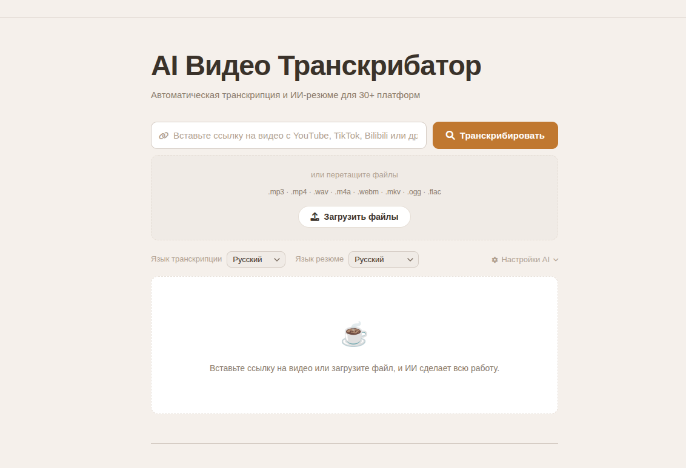

# AI Video Transcriber

 [Русский](https://github.com/akrasnov87/AI-Video-Transcriber/blob/main/README.md) | [English](https://github.com/akrasnov87/AI-Video-Transcriber/blob/main/README_EN.md) | [中文](https://github.com/akrasnov87/AI-Video-Transcriber/blob/main/README_ZH.md)

Инструмент на основе искусственного интеллекта для расшифровки и создания саммари (краткого изложения) видео и подкастов. Вставьте ссылку с YouTube, TikTok, Bilibili, Apple Podcasts, SoundCloud и более чем 30 других платформ **или загрузите локальный файл** (аудио, видео или простой текст).



## ✨ Возможности

*   🎥 **Поддержка множества платформ**: Работает с YouTube, TikTok, Bilibili, Apple Podcasts, SoundCloud и более чем 30 другими сервисами.
*   📁 **Загрузка локальных файлов**: Перетащите или выберите файл. Поддерживаемые форматы: `.txt` (обрабатывается как текст расшифровки), `.mp3`, `.mp4`, `.m4a`, `.wav`, `.webm`, `.mkv`, `.ogg`, `.flac`. Медиафайлы нормализуются с помощью FFmpeg для Whisper; для них выполняется тот же конвейер оптимизации → перевода → создания саммари, что и для URL.
*   ⚡ **Архитектура "Субтитры в первую очередь"**: Для платформ, имеющих собственные субтитры (например, YouTube), расшифровка извлекается мгновенно — загрузка аудио не требуется. Whisper используется только как запасной вариант, что делает весь процесс значительно быстрее.
*   🗣️ **Интеллектуальная расшифровка**: Высокоточное преобразование речи в текст с использованием Faster-Whisper, когда субтитры недоступны.
*   🤖 **Оптимизация текста ИИ**: Автоматическое исправление опечаток, завершение предложений и интеллектуальная разбивка на абзацы.
*   🌍 **Многоязычные саммари**: Создание кратких интеллектуальных изложений на нескольких языках.
*   🔧 **Используйте свою модель**: Настройте любой API-эндпоинт, совместимый с OpenAI (OpenAI, OpenRouter, локальная LLM и т.д.) прямо в интерфейсе. Введите ваш API Base URL и API Key, затем нажмите **Fetch**, чтобы автоматически найти все доступные модели и выбрать нужную.
*   ⚙️ **Условный перевод**: Автоматически переводит расшифровку, если язык саммари отличается от исходного языка.
*   📱 **Дружелюбность к мобильным устройствам**: Отличная поддержка мобильных устройств.

## 🚀 Быстрый старт

### Предварительные требования

*   Python 3.8+
*   FFmpeg (требуется для извлечения аудио через yt-dlp и для нормализации загруженных медиафайлов)
*   API-ключ от любого провайдера, совместимого с OpenAI (OpenAI, OpenRouter и т.д.) — настраивается прямо в интерфейсе, переменная окружения на сервере не требуется.

### Установка

#### Способ 1: Автоматическая установка

```bash
# Клонируйте репозиторий
git clone https://github.com/wendy7756/AI-Video-Transcriber.git
cd AI-Video-Transcriber

# Запустите скрипт установки
chmod +x install.sh
./install.sh
```

#### Способ 2: Docker

```bash
# Клонируйте репозиторий
git clone https://github.com/wendy7756/AI-Video-Transcriber.git
cd AI-Video-Transcriber

# Используя Docker Compose (проще всего)
cp .env.example .env
# Отредактируйте файл .env, если хотите задать значения по умолчанию на сервере (опционально)
`docker compose up -d`

# Или используя Docker напрямую
docker build -t ai-video-transcriber .

# или через команду, версия берётся из version

chmod +x build.sh
./build.sh


docker run -p 8000:8000 --env-file .env ai-video-transcriber
```

Образ использует **Python 3.12** (Debian Bookworm), обновляет `pip`/`setuptools`/`wheel`, а затем устанавливает зависимости из `requirements.txt` — те же ограничения версий, что и в свежем локальном виртуальном окружении на актуальном Python.

#### Способ 3: Ручная установка

1.  **Установите зависимости Python**

    ```bash
    # macOS (PEP 668) настоятельно рекомендует использовать virtualenv
    python3 -m venv venv
    source venv/bin/activate
    python -m pip install --upgrade pip
    pip install -r requirements.txt
    ```

2.  **Установите FFmpeg**

    ```bash
    # macOS
    brew install ffmpeg

    # Ubuntu/Debian
    sudo apt update && sudo apt install ffmpeg

    # CentOS/RHEL
    sudo yum install ffmpeg
    ```

3.  **Настройте переменные окружения** _(опционально)_

    ```bash
    # Если вы предпочитаете задать значения по умолчанию на сервере, установите их здесь.
    # В противном случае настройте всё через интерфейс.
    export OPENAI_API_KEY="ваш_api_ключ_здесь"
    export OPENAI_BASE_URL="https://openrouter.ai/api/v1" # любой эндпоинт, совместимый с OpenAI
    ```

### Запустите сервис

```bash
python3 start.py
```

После запуска сервиса откройте браузер и перейдите по адресу `http://localhost:8000`

#### Производственный режим (рекомендуется для длинных видео)

Чтобы избежать разрывов SSE-соединения во время длительной обработки, запустите в производственном режиме (горячая перезагрузка отключена):

```bash
python3 start.py --prod
```

Это обеспечивает стабильность SSE-соединения на протяжении долгих задач (30–60+ минут).

#### Запуск с явными переменными окружения (пример)

```bash
source venv/bin/activate
export OPENAI_API_KEY=ваш_api_ключ_здесь         # опционально: значение по умолчанию на сервере
# export OPENAI_BASE_URL=https://openrouter.ai/api/v1  # опционально: значение по умолчанию на сервере
python3 start.py --prod
```

## 📖 Руководство по использованию

1.  **Выберите источник — URL или файл**
    *   **URL видео/подкаста**: Вставьте ссылку с YouTube, Bilibili или любой другой поддерживаемой платформы в поле ввода.
    *   **Локальный файл**: Перетащите файл в пунктирную область загрузки (или нажмите для выбора файла). Нажмите ту же кнопку **Transcribe**, чтобы начать обработку. Загрузки используют тот же маршрут API, что и URL (`POST /api/process-video` с multipart `file`), что полезно, если обратный прокси-сервер разрешает только этот путь.
2.  **Выберите язык саммари**: Выберите язык итогового изложения из выпадающего списка рядом с полем ввода.
3.  **(Опционально) Настройте модель ИИ**: Нажмите **AI Settings**, чтобы развернуть панель.
    *   Введите ваш **API Base URL** (например, `https://openrouter.ai/api/v1`) и **API Key**.
    *   Нажмите **Fetch**, чтобы автоматически загрузить все доступные модели от этого провайдера.
    *   Выберите нужную модель или оставьте поле пустым, чтобы использовать серверную модель по умолчанию.
4.  **Начните обработку**: Нажмите кнопку **Transcribe**. Для задач с **URL** индикатор прогресса показывает, какой режим активен:
    *   **⚡ Субтитры** (зеленый) — найдены встроенные субтитры, расшифровка извлечена за секунды.
    *   **🎙 Whisper** (янтарный) — субтитры недоступны, выполняется загрузка аудио для расшифровки.
    Для **локальных загрузок** медиа нормализуется с помощью FFmpeg, а затем расшифровывается через Whisper; простые **`.txt`** файлы пропускают этапы загрузки и Whisper и сразу переходят в текстовый конвейер (оптимизация → саммари, и перевод, если языки различаются).
5.  **Просмотрите результаты**: Ознакомьтесь с оптимизированной расшифровкой и саммари от ИИ.
    *   Если язык расшифровки ≠ выбранному языку саммари, автоматически появляется вкладка **Translation**.
6.  **Скачайте файлы**: Сохраните файлы в формате Markdown (Расшифровка / Перевод / Саммари).

## 🛠️ Техническая архитектура

### Бэкенд

*   **FastAPI**: Современный веб-фреймворк для Python.
*   **yt-dlp**: Загрузка и обработка видео.
*   **FFmpeg**: Извлечение аудио и нормализация загружаемых медиафайлов (моно, 16 кГц для Whisper).
*   **Faster-Whisper**: Эффективная расшифровка речи.
*   **OpenAI API**: Интеллектуальное создание саммари.

### Фронтенд

*   **HTML5 + CSS3**: Адаптивный дизайн интерфейса.
*   **JavaScript (ES6+)**: Современная логика фронтенда.
*   **Marked.js**: Рендеринг Markdown.
*   **Font Awesome**: Библиотека иконок.

### Структура проекта

```
AI-Video-Transcriber/
├── backend/                 # Бэкенд код
│   ├── main.py             # Основное приложение FastAPI
│   ├── video_processor.py  # Модуль обработки видео
│   ├── transcriber.py      # Модуль расшифровки
│   ├── summarizer.py       # Модуль создания саммари
│   ├── translator.py       # Модуль перевода
│   └── llm_sanitize.py     # Пост-обработка выводов LLM (удаление шаблонного текста)
├── static/                 # Фронтенд файлы
│   ├── index.html          # Главная страница
│   └── app.js              # Логика фронтенда
├── temp/                   # Директория для временных файлов
├── Dockerfile              # Конфигурация Docker образа
├── docker-compose.yml      # Конфигурация Docker Compose
├── .dockerignore           # Правила игнорирования для Docker
├── .env.example            # Шаблон переменных окружения
├── requirements.txt        # Зависимости Python
├── start.py                # Скрипт запуска
└── README.md               # Документация проекта
```

## ⚙️ Настройка

### Переменные окружения

| Переменная | Описание | Значение по умолчанию | Обязательная |
| :--- | :--- | :--- | :--- |
| `OPENAI_API_KEY` | API-ключ (значение по умолчанию на сервере) | - | Нет — можно задать в интерфейсе |
| `HOST` | Адрес сервера | `0.0.0.0` | Нет |
| `PORT` | Порт сервера | `8000` | Нет |
| `WHISPER_MODEL_SIZE` | Размер модели Whisper | `base` | Нет |
| `UPLOAD_MAX_MB` | Максимальный размер загружаемого локального файла (МБ) | `2000` | Нет |

Существует опциональный выделенный эндпоинт `POST /api/process-upload` с тем же поведением, что и отправка `file` в `/api/process-video`.

### Доступные размеры модели Whisper

| Модель | Параметры | Только английский | Многоязычная | Скорость | Использование памяти |
| :--- | :--- | :--- | :--- | :--- | :--- |
| tiny | 39 M | ✓ | ✓ | Быстрая | Низкое |
| base | 74 M | ✓ | ✓ | Средняя | Низкое |
| small | 244 M | ✓ | ✓ | Средняя | Среднее |
| medium | 769 M | ✓ | ✓ | Медленная | Среднее |
| large | 1550 M | ✗ | ✓ | Очень медленная | Высокое |

## 🔧 Часто задаваемые вопросы (FAQ)

### В: Почему расшифровка происходит медленно?

**О:** Скорость расшифровки зависит от длины видео, размера модели Whisper и производительности аппаратного обеспечения. Попробуйте использовать модели поменьше (например, tiny или base), чтобы увеличить скорость.

### В: Какие видеоплатформы поддерживаются?

**О:** Все платформы, поддерживаемые yt-dlp, включая, но не ограничиваясь: YouTube, TikTok, Facebook, Instagram, Twitter, Bilibili, Youku, iQiyi, Tencent Video и другие.

### В: Какие типы локальных файлов и ограничения по размеру поддерживаются?

**О:** Разрешенные расширения: `.txt`, `.mp3`, `.mp4`, `.m4a`, `.wav`, `.webm`, `.mkv`, `.ogg`, `.flac`. Максимальный размер по умолчанию — **200 МБ** на файл. Его можно изменить с помощью переменной окружения `UPLOAD_MAX_MB` на сервере.

### В: Что делать, если функции оптимизации ИИ недоступны?

**О:** Функции ИИ требуют API-ключа от провайдера, совместимого с OpenAI (OpenAI, OpenRouter и т.д.). Вы можете ввести его прямо на панели **AI Settings** в интерфейсе — перезапуск сервера не требуется. Как вариант, вы можете установить `OPENAI_API_KEY` как переменную окружения для задания значения по умолчанию на сервере.

### В: Я получаю HTTP 500 ошибки при запуске или использовании сервиса. Почему?

**О:** В большинстве случаев это проблема конфигурации окружения, а не ошибка в коде. Пожалуйста, проверьте:

*   Активировано ли виртуальное окружение: `source venv/bin/activate`
*   Установлены ли зависимости внутри виртуального окружения: `pip install -r requirements.txt`
*   Настроен ли ваш API-ключ на панели **AI Settings** или через переменную окружения `OPENAI_API_KEY`
*   Установлен ли FFmpeg: `brew install ffmpeg` (macOS) / `sudo apt install ffmpeg` (Debian/Ubuntu)
*   Если порт 8000 занят, остановите старый процесс или измените `PORT`

### В: Как обрабатываются длинные видео?

**О:** Система может обрабатывать видео любой длины, но время обработки будет увеличиваться соответственно. Для очень длинных видео рассмотрите возможность использования меньших моделей Whisper.

### В: Как использовать Docker для развертывания?

**О:** Docker предоставляет самый простой способ развертывания.

**Предварительные требования:**
*   Установите Docker Desktop с https://www.docker.com/products/docker-desktop/
*   Убедитесь, что служба Docker запущена.

**Быстрый старт:**
```bash
# Клонирование и настройка
git clone https://github.com/wendy7756/AI-Video-Transcriber.git
cd AI-Video-Transcriber
cp .env.example .env
# Отредактируйте файл .env для установки значений по умолчанию на сервере (опционально)

# Запуск с помощью Docker Compose (рекомендуется)
`docker compose up -d`

# Или ручная сборка и запуск
docker build -t ai-video-transcriber .
docker run -p 8000:8000 --env-file .env ai-video-transcriber
```

**Распространенные проблемы с Docker:**
*   **Конфликт портов**: Измените маппинг портов `-p 8001:8000`, если порт 8000 занят.
*   **Отказ в доступе**: Убедитесь, что Docker Desktop запущен и у вас есть соответствующие разрешения.
*   **Ошибка сборки**: Проверьте свободное место на диске (требуется ~2 ГБ) и сетевое соединение.
*   **Контейнер не запускается**: Проверьте логи Docker с помощью `docker logs <container_id>`.

**Команды Docker:**
```bash
# Просмотр запущенных контейнеров
docker ps

# Просмотр логов контейнера
docker logs ai-video-transcriber-ai-video-transcriber-1

# Остановка сервиса
`docker compose down`

# Пересборка после изменений
`docker-compose build --no-cache`
```

### В: Каковы требования к памяти?

**О:** Использование памяти зависит от метода развертывания и рабочей нагрузки.

**Развертывание с Docker:**
*   **Базовая память**: ~128 МБ для бездействующего контейнера.
*   **Во время обработки**: 500 МБ - 2 ГБ в зависимости от длины видео и модели Whisper.
*   **Размер Docker образа**: Требуется ~1.6 ГБ дискового пространства.
*   **Рекомендуется**: 4 ГБ+ ОЗУ для стабильной работы.

**Традиционное развертывание:**
*   **Базовая память**: ~50-100 МБ для FastAPI сервера.
*   **Использование памяти моделями Whisper**:
    *   `tiny`: ~150 МБ
    *   `base`: ~250 МБ
    *   `small`: ~750 МБ
    *   `medium`: ~1.5 ГБ
    *   `large`: ~3 ГБ
*   **Пиковое использование**: База + Модель + Обработка видео (~500 МБ дополнительно).

**Советы по оптимизации памяти:**
```bash
# Используйте меньшую модель Whisper для снижения использования памяти
WHISPER_MODEL_SIZE=tiny  # или base

# Для Docker, при необходимости ограничьте память контейнера
docker run -m 1g -p 8000:8000 --env-file .env ai-video-transcriber

# Мониторинг использования памяти
docker stats ai-video-transcriber-ai-video-transcriber-1
```

### В: Ошибки сетевого соединения или тайм-ауты?

**О:** Если вы сталкиваетесь с сетевыми ошибками во время загрузки видео или вызовов API, попробуйте следующие решения:

**Распространенные сетевые проблемы:**
*   Загрузка видео завершается с ошибкой "Unable to extract" или тайм-аутом.
*   Вызовы OpenAI API возвращают тайм-аут соединения или ошибки разрешения DNS.
*   Загрузка Docker образа не удается или происходит крайне медленно.

**Решения:**
1.  **Переключите VPN/Прокси**: Попробуйте подключиться к другому VPN-серверу или изменить настройки прокси.
2.  **Проверьте стабильность сети**: Убедитесь, что ваше интернет-соединение стабильно.
3.  **Повторите попытку после смены сети**: Подождите 30-60 секунд после изменения сетевых настроек перед повторной попыткой.
4.  **Используйте альтернативные эндпоинты**: Если вы используете пользовательские эндпоинты OpenAI, убедитесь, что они доступны из вашей сети.
5.  **Проблемы с сетью Docker**: Перезапустите Docker Desktop, если сетевое взаимодействие контейнеров не работает.

**Быстрый тест сети:**
```bash
# Проверка доступа к видеоплатформе
curl -I https://www.youtube.com/

# Проверка вашего эндпоинта AI-провайдера
curl -I https://openrouter.ai

# Проверка доступа к Docker Hub
docker pull hello-world
```

## 🎯 Поддерживаемые языки

### Расшифровка
*   Поддерживает 100+ языков через Whisper.
*   Автоматическое определение языка.
*   Высокая точность для основных языков.

### Создание саммари
*   Английский
*   Китайский (упрощенный)
*   Японский
*   Корейский
*   Испанский
*   Французский
*   Немецкий
*   Португальский
*   Русский
*   Арабский
*   И другие...

## 📈 Советы по производительности

*   **Аппаратные требования**:
    *   Минимальные: 4 ГБ ОЗУ, двухъядерный CPU.
    *   Рекомендуемые: 8 ГБ ОЗУ, четырехъядерный CPU.
    *   Идеальные: 16 ГБ ОЗУ, многоядерный CPU, SSD-накопитель.
*   **Оценка времени обработки**:

| Длина видео | Режим субтитров | Режим Whisper | Примечания |
| :--- | :--- | :--- | :--- |
| 1 минута | ~5 с | 30 с–1 мин | Режиму субтитров не нужна загрузка аудио |
| 5 минут | ~10 с | 2–5 мин | Автоматические субтитры YouTube активируют режим субтитров |
| 15 минут | ~15 с | 5–15 мин | Большинство видео на YouTube поддерживают режим субтитров |
| 30+ минут | ~20 с | 15–60 мин | Подкасты/только аудио всегда используют Whisper |

## 🤝 Вклад в проект

Мы приветствуем сообщения об ошибках (Issues) и запросы на включение изменений (Pull Requests)!

1.  Сделайте форк проекта.
2.  Создайте ветку для новой функции (`git checkout -b feature/AmazingFeature`).
3.  Зафиксируйте ваши изменения (`git commit -m 'Add some AmazingFeature'`).
4.  Отправьте изменения в вашу ветку (`git push origin feature/AmazingFeature`).
5.  Откройте запрос на включение (Pull Request).

## Благодарности

*   [yt-dlp](https://github.com/yt-dlp/yt-dlp) — Мощный инструмент для загрузки видео.
*   [Faster-Whisper](https://github.com/SYSTRAN/faster-whisper) — Эффективная реализация Whisper.
*   [FastAPI](https://fastapi.tiangolo.com/) — Современный веб-фреймворк для Python.
*   [OpenAI](https://openai.com/) — API для интеллектуальной обработки текста.

## 📞 Контакты

По вопросам или предложениям, пожалуйста, создайте Issue или свяжитесь с Wendy.

---

## 🚀 Попробуйте полную версию продукта — sipsip.ai

Этот инструмент является открытой частью **sipsip.ai**.

Полная версия продукта предлагает больше возможностей:

*   📧 **Ежедневные email-дайджесты** — подпишитесь на любимых авторов и получайте ИИ-подборку контента каждое утро.
*   ⚡ Расшифровывайте и создавайте саммари любых видео и подкастов по запросу.
*   🌐 Многоязычная поддержка во всех функциях.

**Начните бесплатно** — кредитная карта не требуется.

➡️ [sipsip.ai](https://sipsip.ai)

---

## ⭐ История звезд

Если этот проект оказался для вас полезным, пожалуйста, поставьте ему звезду на GitHub!
